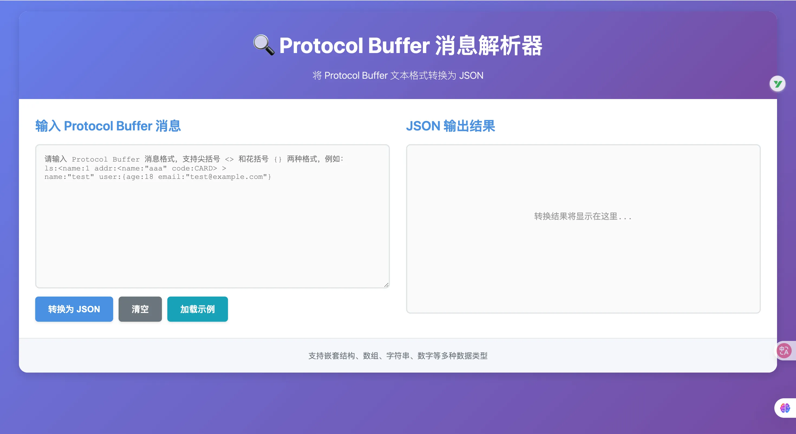

# Protocol Buffer 消息解析器

一个简单而强大的 Web 应用，用于将 Protocol Buffer 文本格式转换为易读的 JSON 格式。



## ✨ 功能特性

- 🔄 **格式转换**：将 Protocol Buffer 文本格式实时转换为 JSON
- 📝 **语法高亮**：美观的 JSON 输出显示
- 🎯 **智能解析**：支持嵌套结构、数组、字符串、数字等多种数据类型
- 🔀 **双格式支持**：同时支持尖括号 `<>` 和花括号 `{}` 两种 Protocol Buffer 文本格式
- 📋 **一键复制**：快速复制 JSON 结果到剪贴板
- 💾 **示例数据**：内置示例数据，方便快速测试
- 🎨 **现代界面**：响应式设计，支持移动端和桌面端
- ⚡ **纯前端解析**：无需后端 API，所有解析在浏览器中完成
- 🚀 **Go 后端**：可选的 Go 服务器用于托管静态文件

## 📋 项目结构

```
protobuf-msg-reader/
├── index.html          # 主页面
├── style.css           # 样式文件
├── parser.js           # Protocol Buffer 解析器核心逻辑
├── app.js              # 应用主逻辑和事件处理
├── main.go             # Go 后端服务器
├── go.mod              # Go 模块配置
├── .gitignore          # Git 忽略文件
└── README.md           # 项目说明文档
```

## 🚀 快速开始

### 方式一：直接在浏览器中打开（无需后端）

1. 克隆或下载项目到本地
2. 直接在浏览器中打开 `index.html` 文件
3. 开始使用！

### 方式二：使用 Go 后端服务器

#### 前置要求

- Go 1.21 或更高版本

#### 启动步骤

1. **克隆项目**

```bash
git clone <your-repo-url>
cd protobuf-msg-reader
```

2. **启动服务器**

```bash
go run main.go
```

或者编译后运行：

```bash
go build -o protobuf-msg-reader
./protobuf-msg-reader
```

3. **访问应用**

打开浏览器访问：`http://localhost:8080`

4. **自定义端口**

```bash
PORT=3000 go run main.go
```

## 📖 使用说明

### 基本使用

1. **输入 Protocol Buffer 消息**
   
   - 在左侧输入框中输入 Protocol Buffer 文本格式数据
   - 支持复杂的嵌套结构

2. **转换为 JSON**
   
   - 点击「转换为 JSON」按钮
   - 或使用快捷键：`Ctrl+Enter`（Mac: `Cmd+Enter`）

3. **查看结果**
   
   - 右侧会显示格式化的 JSON 输出
   - 可以使用「复制 JSON」按钮复制结果
   - 使用「压缩/美化」按钮切换 JSON 格式

### 示例数据

点击「加载示例」按钮可以加载预设的示例数据：

**示例 1：尖括号格式**

```text
groups:<group_size:2 modules:<label:"alpha" module_kind:PANEL forecast_block:<> module_ref:<primary_key:9001 secondary_key:42> > > groups:<group_size:1 modules:
<label:"beta" module_kind:WIDGET misc_block:<header:"beta-zone" columns:5 item_refs:<ref_oid:333 ref_code:777> layout_mode:TABLE > module_ref:<primary_key:"xyz-token" secondary_key:99> > >
```

**示例 2：花括号格式**

```text
name:"yan" user:{age:18 addrs:"bb" email:"yan@example.com"}
```

**混合使用**

```text
groups:<group_size:2 modules:<label:"alpha" module_kind:PANEL forecast_block:<> module_ref:<primary_key:9001 secondary_key:42> > > groups:<group_size:1 modules:<label:"beta" module_kind:WIDGET misc_block:<header:"beta-zone" columns:5 item_refs:<ref_oid:333 ref_code:777> layout_mode:TABLE > module_ref:<primary_key:"xyz-token" secondary_key:99> > >
```

转换后的 JSON 示例：

```json
{
   "groups": [
      {
         "group_size": 2,
         "modules": {
            "label": "alpha",
            "module_kind": "PANEL",
            "forecast_block": {},
            "module_ref": {
               "primary_key": 9001,
               "secondary_key": 42
            }
         }
      },
      {
         "group_size": 1,
         "modules": {
            "label": "beta",
            "module_kind": "WIDGET",
            "misc_block": {
               "header": "beta-zone",
               "columns": 5,
               "item_refs": {
                  "ref_oid": 333,
                  "ref_code": 777
               },
               "layout_mode": "TABLE"
            },
            "module_ref": {
               "primary_key": "xyz-token",
               "secondary_key": 99
            }
         }
      }
   ]
}
```

## 🔧 支持的数据类型

- **字符串**：`name:"value"`
- **数字**：`count:123` 或 `price:45.67`
- **嵌套消息（尖括号）**：`nested:<field:value>`
- **嵌套消息（花括号）**：`nested:{field:value}`
- **空消息**：`empty:<>` 或 `empty:{}`
- **重复字段**（数组）：同一字段出现多次会自动转换为数组
- **枚举值**：`status:ACTIVE`
- **混合格式**：同一消息中可以混用尖括号和花括号

## 🛠️ 技术栈

### 前端

- **HTML5**：页面结构
- **CSS3**：样式和动画
- **原生 JavaScript**：核心逻辑，无依赖

### 后端

- **Go**：轻量级 HTTP 服务器
- **标准库**：仅使用 Go 标准库，无第三方依赖

## 📦 部署

### 本地部署

已在「快速开始」部分说明。

### 生产部署

1. **编译 Go 程序**

```bash
# Linux
GOOS=linux GOARCH=amd64 go build -o protobuf-msg-reader

# Windows
GOOS=windows GOARCH=amd64 go build -o protobuf-msg-reader.exe

# macOS
GOOS=darwin GOARCH=amd64 go build -o protobuf-msg-reader
```

2. **部署到服务器**

将编译后的二进制文件和所有前端文件（HTML、CSS、JS）上传到服务器，然后运行：

```bash
./protobuf-msg-reader
```

3. **使用进程管理器**（推荐）

使用 `systemd`、`supervisor` 或 `pm2` 等工具管理进程。

### Docker 部署

项目已包含优化的多阶段构建 Dockerfile，可以直接使用。

#### 前置要求

- Docker 已安装并运行

#### 使用步骤

1. **构建 Docker 镜像**

```bash
docker build -t protobuf-msg-reader .
```

2. **运行容器**

```bash
# 基本运行（默认端口 8080）
docker run -d -p 8080:8080 --name pb-reader protobuf-msg-reader

# 使用自定义端口
docker run -d -p 3000:3000 -e PORT=3000 --name pb-reader protobuf-msg-reader

# 前台运行（查看日志）
docker run -p 8080:8080 --name pb-reader protobuf-msg-reader
```

3. **访问应用**

打开浏览器访问：`http://localhost:8080`

4. **常用 Docker 命令**

```bash
# 查看运行中的容器
docker ps

# 查看容器日志
docker logs pb-reader

# 停止容器
docker stop pb-reader

# 启动容器
docker start pb-reader

# 删除容器
docker rm pb-reader

# 删除镜像
docker rmi protobuf-msg-reader
```

#### Docker 镜像特点

- **多阶段构建**：构建阶段和运行阶段分离，最终镜像更小
- **轻量级**：基于 Alpine Linux，镜像大小约 10-15MB
- **安全**：静态编译，无 CGO 依赖
- **快速**：容器启动速度快，资源占用低

## 🤝 贡献

欢迎提交 Issue 和 Pull Request！
